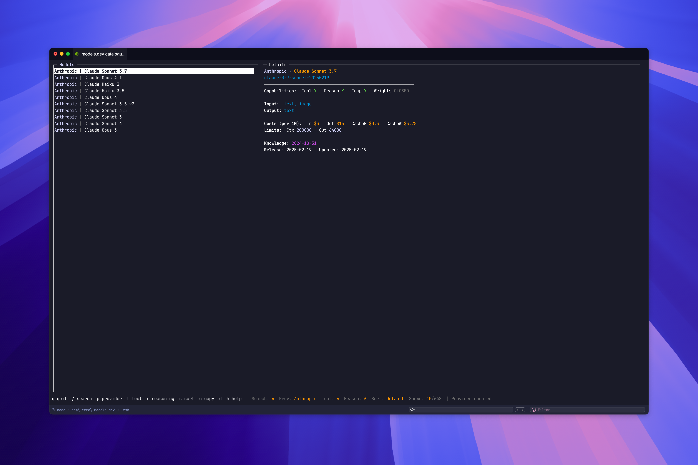
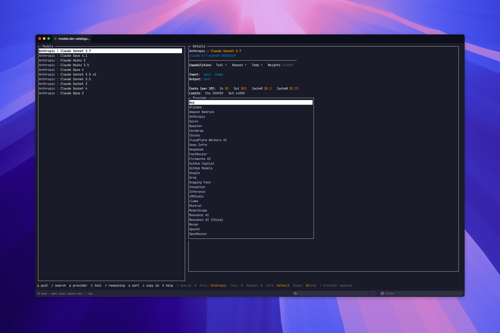
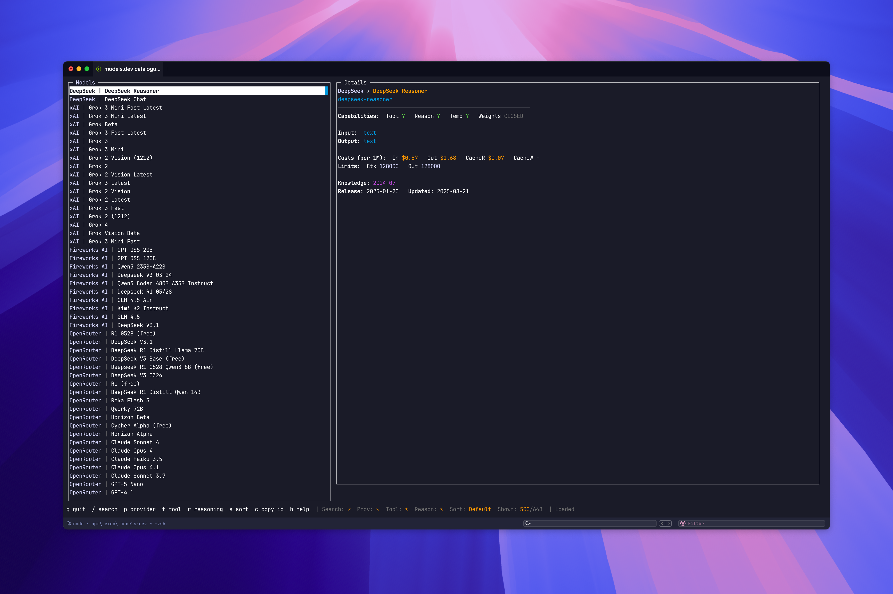

<div align="center">

# models-dev CLI

Explore the models.dev catalogue from your terminal. Fast search, rich TUI, copy-to-clipboard.

[](https://www.npmjs.com/package/@kud/models-dev-cli)


</div>

---

## TL;DR

```bash
# one‑shot
npx models-dev

# or install globally
npm i -g @kud/models-dev-cli
models-dev   # alias: mdl
```

The CLI fetches the live catalogue and opens a split‑pane TUI by default. Prefer a non‑interactive table? Use flags (below) or `--ui table`.

## Preview

<!-- Screenshots of the command in action -->
<p align="center">
  
  <br />
  <em>Interactive TUI – split‑pane with detailed model info, costs, limits and meta.</em>
</p>

<p align="center">
  
  <br />
  <em>Provider picker (press <code>p</code>) to quickly filter the catalogue.</em>
</p>

<p align="center">
  
  <br />
  <em>Model list with fuzzy search and color badges for capabilities.</em>
</p>


<p align="center">
  
  <br />
  <em>Non‑interactive table mode with an actions prompt for filtering and paging.</em>
</p>

## Highlights

- Blazing‑fast fuzzy search (Fuse) across name and id
- Filters for provider, tool‑calling, and reasoning
- Colorful split‑pane TUI with detail panel and copy‑ID
- Script‑friendly JSON and table output modes
- Safe terminal handling (works around Setulc/terminfo issues in iTerm2)

## Interactive TUI

Keybindings:

- `/`: search (fuzzy; blank clears)
- `p`: provider picker
- `t`: cycle tool filter (Any → Yes → No)
- `r`: cycle reasoning filter (Any → Yes → No)
- `s`: cycle sort (Default → Provider → Input $ → Output $ → Context)
- `c`: copy current model id to clipboard
- `h`: toggle the help/status bar
- `q`: quit
- Navigation: arrows or `j/k`, PageUp/PageDown scroll

Tips:

- The left list shows the provider in cyan and the model name in white.
- The detail panel groups info into Capabilities, Modalities, Costs, Limits and Meta, with color badges for quick scanning.

Force a mode:

```bash
MODELS_DEV_UI=blessed models-dev     # force TUI
MODELS_DEV_UI=table models-dev       # force table prompt mode
```

## Non‑Interactive Usage

```bash
models-dev --search claude
models-dev --provider openai --sort input-cost
models-dev --tool --reasoning
models-dev --provider anthropic --compact
models-dev --search grok --json
```

Flags:

- `--search <term>`: substring match on name/id
- `--provider <name>`: provider id or display name (case‑insensitive)
- `--tool`: only models with tool calling
- `--reasoning`: only models with reasoning capability
- `--sort <field>`: one of `input-cost`, `output-cost`, `provider` (the TUI exposes additional sorts)
- `--json`: emit raw JSON for the resulting models
- `--compact`: print `provider:model:name:id` per line
- `--ui <mode>`: `blessed | table | auto` (default)

## Output Columns

Shown in both the non‑interactive table and the interactive list view when applicable:

- Provider, Model, Provider ID, Model ID
- Tool, Reason (reasoning capability)
- Modalities (input/output)
- Costs (input/output/cache read/cache write; per 1M tokens)
- Limits (context, output tokens)
- Temperature flag, Weight openness, Knowledge cutoff, Release, Updated

Missing numeric/cost fields render as `-`.

## Troubleshooting

Running in iTerm2 and seeing a Setulc/terminfo error? The CLI auto‑detects iTerm2/`xterm-256color` and avoids `tput`, which prevents the crash.

If you still hit issues:

```bash
# simplest workaround
TERM=xterm npx models-dev

# fall back to table UI
models-dev --ui table
```

No color output desired? Set `NO_COLOR=1`.

## Development

```bash
git clone https://github.com/kud/models-dev-cli
cd models-dev-cli
npm install
npm link           # exposes `models-dev` and `mdl`
models-dev         # run locally
```

Code style notes:

- Keep changes minimal and focused
- Prefer small PRs with clear descriptions and screenshots/GIFs for UI changes

## License

MIT
