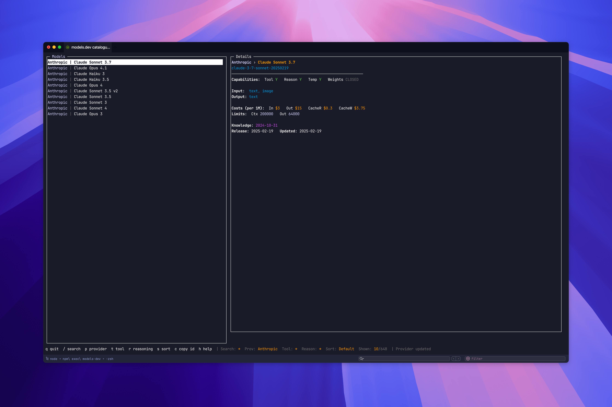

<div align="center">


**CLI to explore and query models.dev catalogue (non-interactive + interactive TUI).**

<a href="https://kud.io/projects/models-dev-cli">Website</a> · <a href="https://kud.io/projects/models-dev-cli/docs">Documentation</a>

</div>

## Features

- **TUI browser** — split-pane interactive interface powered by Blessed; browse, filter, and inspect models without leaving the terminal
- **Fuzzy search** — find any model by name or ID across the full models.dev catalogue
- **Provider filtering** — narrow results to a specific provider by ID or display name
- **Capability flags** — filter instantly for models with tool calling (`--tool`) or reasoning (`--reasoning`)
- **Copy to clipboard** — select a model in the TUI and copy its ID straight to your clipboard
- **Flexible output** — raw JSON (`--json`), compact colon-delimited lines (`--compact`), or a rendered table (`--ui table`)



## Install

```sh
npm install -g @kud/models-dev-cli
```

## Usage

```console
$ models-dev --help
Usage: models-dev [options]

Explore the models.dev catalogue (non-interactive & interactive)

Options:
  -V, --version      output the version number
  --search <term>    Search by model name or id
  --provider <name>  Filter by provider (id or name)
  --tool             Only models with tool calling
  --reasoning        Only models with reasoning capability
  --sort <field>     Sort by field: input-cost | output-cost | provider
  --json             Output raw JSON for resulting models
  --compact          Compact output provider:model:name:id (non-JSON)
  --ui <mode>        Interactive UI mode: blessed | table | auto (default)
  -h, --help         display help for command

$ models-dev --provider anthropic --tool
$ models-dev --search gpt-4 --json
$ mdl --reasoning --sort input-cost
```

## Development

```sh
git clone https://github.com/kud/models-dev-cli.git
cd models-dev-cli
npm install
npm link
models-dev
```

📚 **Full documentation → [models-dev-cli/docs](https://kud.io/projects/models-dev-cli/docs)**
